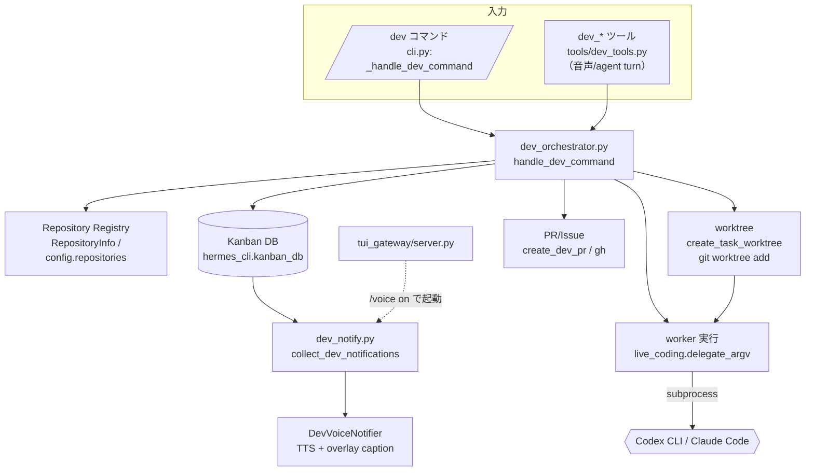
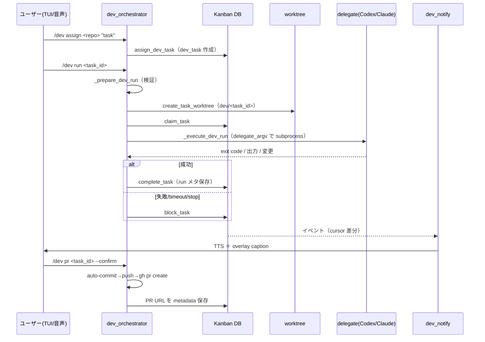

# 基本設計書 — 開発オーケストレーター（システム開発実装の代行）

| 項目       | 内容                                                                                                            |
| ---------- | --------------------------------------------------------------------------------------------------------------- |
| 文書名     | 開発オーケストレーター 基本設計書                                                                               |
| バージョン | 1.0                                                                                                             |
| 作成日     | 2026-06-16                                                                                                      |
| ステータス | ドラフト                                                                                                        |
| 関連文書   | `docs/requirements/dev-orchestrator-requirements.md`（要件定義書）, `docs/plans/2026-06-07-dev-orchestrator.md` |
| 凡例       | ✅ 実装済み / 🟡 部分実装 / ⬜ 計画のみ。FR 参照は要件定義書の DO-FR-xx。                                       |

---

## 1. アーキテクチャ概要

`cli.py::_handle_dev_command` を入口に、`dev_orchestrator.py` が repo registry・タスク・worktree・worker・PR・通知を統括する。実装委譲は `live_coding.py` の delegate 基盤を共用し、永続状態は Kanban DB が正本。



## 2. コンポーネント設計

| コンポーネント       | ファイル                                     | 主要クラス/関数                                                                                                                             | 責務                                                                             | 状態 |
| -------------------- | -------------------------------------------- | ------------------------------------------------------------------------------------------------------------------------------------------- | -------------------------------------------------------------------------------- | ---- |
| ディスパッチャ       | `cli.py`                                     | `_handle_dev_command` → `dev_orchestrator.handle_dev_command(arg, config, saver, opener, deleter)`                                          | `/dev` サブコマンド分岐（status/repos/repo/assign/tasks/run/stop/issue/pr/open） | ✅   |
| オーケストレータ中核 | `hermes_cli/dev_orchestrator.py`（約1600行） | `handle_dev_command`, `assign_dev_task`, `start_dev_task`, `_prepare_dev_run`, `_execute_dev_run`, `create_dev_pr`                          | repo/タスク/worktree/worker/PR/通知の統括                                        | ✅   |
| Repository Registry  | `hermes_cli/dev_orchestrator.py`             | `RepositoryInfo`, `load_repositories`, `get_repository`, `add_repository`, `remove_repository`, `_git_remote_github`, `_git_default_branch` | repo 登録情報の読込・推定・更新                                                  | ✅   |
| Task Store           | `hermes_cli/kanban_db.py`（共用）            | `claim_task`, `complete_task`, `block_task`, `parse_dev_task_metadata`, `_update_task_meta`                                                 | dev タスク（`kind=dev_task`＋`dev-task-meta` JSON）の永続化（正本）              | ✅   |
| Worktree             | `hermes_cli/dev_orchestrator.py`             | `create_task_worktree`                                                                                                                      | `git worktree add -b dev/<task_id>`、再利用/再アタッチ                           | ✅   |
| Worker（delegate）   | `hermes_cli/live_coding.py`（共用）          | `delegate_argv`, `_worker_argv`, `_invoke_worker`, `_default_worker_run`, `_write_worker_log`                                               | Codex/Claude の argv 生成・subprocess 実行・ログ                                 | ✅   |
| git/PR 連携          | `hermes_cli/dev_orchestrator.py`             | `_run_git`, `_run_external`, `create_dev_pr`, `_generate_pr_body`, `_require_gh`                                                            | ローカル git ＋ `gh`（push/PR）、PR 本文生成                                     | ✅   |
| 通知                 | `hermes_cli/dev_notify.py`                   | `collect_dev_notifications`, `DevVoiceNotifier`, `start_dev_voice_watcher`                                                                  | Kanban イベント→cursor 差分→TTS＋overlay                                         | ✅   |
| エージェントツール   | `tools/dev_tools.py`                         | `dev_status`, `dev_assign`, `dev_run`, `dev_stop`                                                                                           | LLM ツールとして公開（音声/agent turn から呼出）                                 | ✅   |
| watcher 起動         | `tui_gateway/server.py`                      | `start_dev_voice_watcher` 呼出                                                                                                              | `/voice on` 時に通知 watcher を起動                                              | ✅   |

## 3. データモデル

### 3.1 RepositoryInfo（repo registry）

`repo_id`, `local_path`, `github`（owner/repo）, `default_branch`, `worktree_root`, `worker`（codex|claude|hermes）, `exists`, `is_git_repo`。config の `repositories` セクションから構築。

### 3.2 dev-task-meta（Kanban task body 内 JSON）

```text
kind: dev_task
repo_id, github, local_path, worktree_path, branch
issue, pr                      # 連携 Issue 番号 / PR URL
worker                         # codex | claude
requested_by, notify_voice
last_reported_event_id         # 音声通知 cursor
# run メタ: returncode, duration_ms, change_summary, log_path
```

## 4. データフロー / シーケンス



## 5. 主要インターフェース設計

### 5.1 `/dev` サブコマンド（TUI）

| コマンド                                                  | 機能                                                                |
| --------------------------------------------------------- | ------------------------------------------------------------------- |
| `/dev status`                                             | 全体/タスク状況                                                     |
| `/dev repos` / `/dev repo show\|add\|remove`              | repo registry 操作                                                  |
| `/dev assign <repo_id> <task>` `[--worker w] [--issue n]` | タスク投入（Issue からも）                                          |
| `/dev tasks [--repo r\|--all]`                            | タスク一覧（done は `tasks_recent_hours` で非表示、blocked は残す） |
| `/dev run <task_id> [--wait]`                             | 実行（既定 background、`--wait` 同期）                              |
| `/dev stop <task_id>`                                     | 実行停止（blocked 化）                                              |
| `/dev issue <repo_id> [list\|<number>]`                   | Issue 一覧/詳細（`gh`）                                             |
| `/dev pr <task_id> [--confirm]`                           | PR 作成（`--confirm` 必須、なしはプレビュー）                       |
| `/dev open <repo_id>`                                     | VS Code で開く                                                      |

### 5.2 エージェントツール（`tools/dev_tools.py`）

`dev_status` / `dev_assign` / `dev_run` / `dev_stop` を LLM ツール化。音声 turn（STT→agent）から呼べるため「kai のバグ直して」「状況教えて」が動作する。

### 5.3 worker 起動（delegate argv）

- Codex: `codex exec -- <prompt>`
- Claude: `claude -p [--model <m>] [--permission-mode acceptEdits] [--allowedTools <rules>] -- <prompt>`
- worker prompt 方針: シークレット/.env/token 読込禁止、push/PR/Issue 作成禁止、テスト実行を指示。

## 6. 設定スキーマ（`hermes_cli/config.py` デフォルト）

```yaml
dev_orchestrator:
  enabled: true
  default_worker: codex          # codex | claude | hermes(未実装)
  worktree_root: ~/.hermes/dev-worktrees
  worker_timeout_seconds: 3600   # 60分
  auto_create_pr: false
  tasks_recent_hours: 2
  require_approval_for_issue_create: true
  require_approval_for_pr_create: true
  require_approval_for_push: true
  require_approval_for_commit: false   # auto-commit 許可
  voice_notifications:
    enabled: true
    max_chars: 120
    cooldown_seconds: 10
    report_started: true
    report_completed: true
    report_blocked: true
    report_failed: true
  vscode: { command: code, fallback_macos_app: "Visual Studio Code" }

repositories: {}   # repo_id -> { local_path, github, default_branch, worktree_root, worker }

stream_assistant:
  coding:            # delegate 基盤（dev worker と共用）
    delegate_to: codex            # codex | claude
    codex_path: codex
    claude_path: claude
    claude_model: ""
    claude_permission_mode: acceptEdits
    claude_allowed_tools: []      # 例: ["Bash(uv run pytest:*)"]
    timeout_seconds: 900
    allow_file_edits: true
    require_approval_for_commit: true
    require_approval_for_push: true
    require_approval_for_delete: true
    block_secret_paths: true
```

> 注: `dev_orchestrator.*` は `.env.example` に未反映（config 経由）。設定ドキュメント整備が必要（要件定義書 D-F）。

## 7. 並行性・状態管理

- `/dev run` はタスクごとにデーモンスレッド（`start_dev_task`）でバックグラウンド実行。worktree が task_id 隔離のため複数並行可。
- 状態遷移: `assign`（作成）→ `claim`（実行開始）→ `complete`（成功）/ `block`（失敗・timeout・stop）。run メタ（returncode/duration/change_summary/log_path）を Kanban に保存。
- 通知 cursor: `last_reported_event_id` を metadata に保持し、`collect_dev_notifications` が差分のみ配信（重複読み上げ防止）。

## 8. エラー処理・フォールバック

| 事象                         | 振る舞い                                                            |
| ---------------------------- | ------------------------------------------------------------------- |
| worker 失敗 / timeout / stop | `block_task`（blocked として記録、配信/TUI は落とさない）           |
| `gh` 未インストール/未設定   | `_require_gh` で前提エラー、認証エラーは `gh` 出力をそのまま提示    |
| PR 既存（"already exists"）  | 出力を解析し URL を冪等に採用、metadata 保存                        |
| 出力過大                     | `_OUTPUT_TAIL_CHARS=4000`、PR diff は `_PR_DIFF_MAX_CHARS` で切詰め |
| worktree 残存ブランチ        | 再アタッチ/再利用で安全に継続                                       |

## 9. 安全性・セキュリティ設計

- **隔離**: worktree でタスクを分離し、共有チェックアウト・他タスクを汚さない。
- **権限**: worker は `acceptEdits`＋`claude_allowed_tools` で限定。worker prompt がシークレット読込・push・PR/Issue 作成を禁止。
- **承認ゲート**: 外部公開アクション（push/PR/Issue 起票）は既定で承認必須。`/dev pr` は `--confirm` 必須。commit は auto 許可（`require_approval_for_commit: false`）。
- **秘密情報**: `block_secret_paths`、`live_coding.sanitize_for_stream`（配信時の TTS/overlay からの秘密除去）。

## 10. 設計上の判断・トレードオフ

- **正本を Kanban DB に**: memory ではなく DB を正本にし、再起動・並行でも一貫性を確保。
- **delegate を `live_coding` と共用**: 配信のライブコーディングと dev orchestrator で同一の Codex/Claude 委譲基盤を使い、重複実装を回避（`delegate_argv`）。
- **`/dev` は slash command**: Kanban alias ではなく slash command に決着（実装上）。
- **承認ゲートの非対称**: commit は自動・push/PR は承認 → 作業は速く、外部影響は人間が最終判断。
- **品質判定の現状**: exit code ベースの自己申告（DO-FR-11 が未達）。テスト検証ゲートの追加が次の重要設計課題。

## 11. テスト方針

- 既存テスト: `tests/hermes_cli/test_dev_orchestrator.py` / `test_dev_tools.py` / `test_dev_notify.py`。
- 重点: repo 推定（github/default branch）、worktree 隔離（2 repo/2 task 並行）、worker 失敗→blocked、PR 冪等採用、通知 cursor の重複防止、承認ゲート（`--confirm` なしで push しない）。
- 追加すべき検証（残課題）: Hermes 側テスト検証ゲート（D-A）、ガードレール（同時実行/コスト上限、D-B）。

## 12. 未実装項目の設計方針（今後）

1. **品質ゲート（D-A）**: worker 完了後、`worktree` 内でテストを実行（または Maker→Checker 的に別 delegate に検証させ）、green を done の条件にする。`stream_assistant.coding.claude_allowed_tools` のテスト許可と整合。
2. **ガードレール（D-B）**: 同時実行スレッド数の上限、worker あたりのコスト/トークン上限（`claude -p --max-budget-usd` の活用）、No-progress 検知。
3. **通知調停（C）**: streaming TTS worker・STT 録音中の保留/割り込みを `dev_notify` と統合制御。
4. **Issue 起票（D）**: `gh issue create` を承認ゲート付きで追加。
5. **dashboard/overlay（E）**: dev 専用 overlay state（active repo/task/PR/test status）と導線。
6. **hermes worker レーン**: 現状エラーの hermes worker を、サンドボックス前提で実装するか判断。
