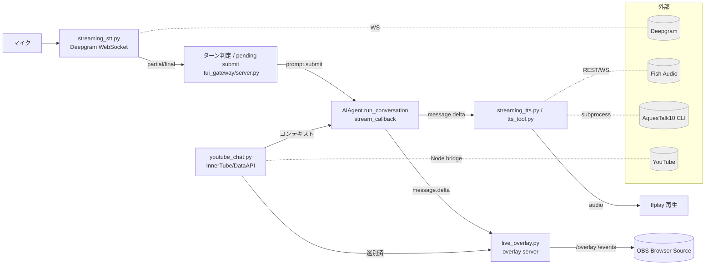
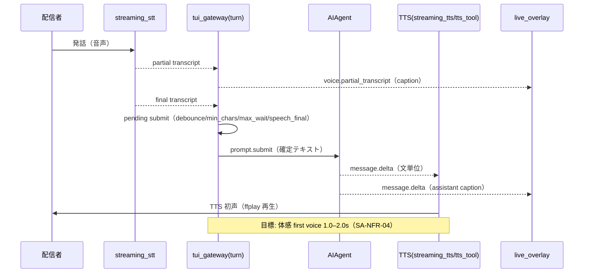
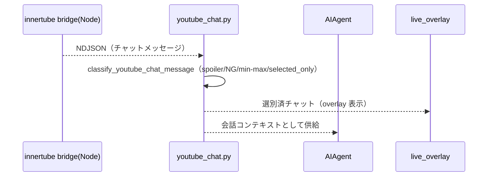

# 基本設計書 — ライブ配信ゲーム実況 AI アシスタント

| 項目       | 内容                                                                                                                                                   |
| ---------- | ------------------------------------------------------------------------------------------------------------------------------------------------------ |
| 文書名     | ライブ配信ゲーム実況 AI アシスタント 基本設計書                                                                                                        |
| バージョン | 1.0                                                                                                                                                    |
| 作成日     | 2026-06-16                                                                                                                                             |
| ステータス | ドラフト                                                                                                                                               |
| 関連文書   | `docs/requirements/streaming-assistant-requirements.md`（要件定義書）、`docs/plans/2026-05-30-*`, `docs/plans/2026-06-01-aquestalk-tts-integration.md` |
| 凡例       | ✅ 実装済み / 🟡 部分実装 / ⬜ 計画のみ。FR 参照は要件定義書の SA-FR-xx。                                                                              |

---

## 1. アーキテクチャ概要

Hermes Agent の既存 agent loop / toolset / config を土台に、**音声ターン pipeline**（STT→ターン判定→agent→TTS/overlay）と**チャット ingestion**、**OBS overlay 出力**を疎結合に組み合わせる。中核オーケストレータは `tui_gateway/server.py`。



## 2. コンポーネント設計

| コンポーネント                   | ファイル                                                 | 主要クラス/関数                                                                                                                          | 責務                                                                                                        | 状態 |
| -------------------------------- | -------------------------------------------------------- | ---------------------------------------------------------------------------------------------------------------------------------------- | ----------------------------------------------------------------------------------------------------------- | ---- |
| STT セッション                   | `hermes_cli/streaming_stt.py`                            | `DeepgramStreamingSession`, `WavAudioSource`, `iter_wav_pcm_chunks`                                                                      | Deepgram WebSocket 接続、PCM16 マイク取得（`sounddevice.RawInputStream`）、partial/final 正規化、WAV replay | ✅   |
| ターン pipeline オーケストレータ | `tui_gateway/server.py`                                  | turn detection / pending submit / commit_delay、`voice.partial_transcript`・`voice.transcript`・`prompt.submit` 発火、`/stream` ハンドラ | 会話ターン終端判定、submit/cancel/rebuffer、TTS worker 配線                                                 | ✅   |
| streaming TTS                    | `hermes_cli/streaming_tts.py`                            | `FishAudioStreamingTTSWorker`                                                                                                            | Fish Audio WebSocket TTS（msgpack encode/decode、text queue、`ffplay` sink、REST fallback）                 | ✅   |
| TTS ディスパッチ                 | `tools/tts_tool.py`                                      | `text_to_speech`, `_generate_fish_audio_tts`, `_generate_aquestalk_tts`                                                                  | provider 振り分け（fish_audio / aquestalk / 既存多数）、AquesTalk 正規化                                    | ✅   |
| 読み辞書                         | `hermes_cli/tts_terms.py`                                | SQLite ストア                                                                                                                            | 用語→読みの辞書、関連語のみ注入                                                                             | ✅   |
| チャット ingestion               | `hermes_cli/youtube_chat.py`                             | `YouTubeChatMessage`, `classify_youtube_chat_message`, `resolve_live_chat_id`, `fetch_youtube_chat_messages`                             | InnerTube/Data API からチャット取得、選別                                                                   | ✅   |
| Node ブリッジ                    | `scripts/youtube-chat-innertube-bridge.mjs`              | （NDJSON 出力）                                                                                                                          | `youtubei.js` で InnerTube チャットを取得し NDJSON で Python に渡す                                         | ✅   |
| overlay サーバ                   | `hermes_cli/live_overlay.py`                             | `LiveOverlayServer`, `publish_caption`, `publish_live_coding_state`                                                                      | overlay HTTP（`/overlay` HTML, SSE `/events`, `/state.json`）、字幕/状態配信                                | ✅   |
| モードプリセット                 | `hermes_cli/stream_assistant.py`                         | `apply_stream_mode`                                                                                                                      | `/stream game`/`status` の config 一括適用                                                                  | ✅   |
| ライブコーディング委譲           | `hermes_cli/live_coding.py`, `tools/live_coding_tool.py` | `run_delegate`, `delegate_argv`, `sanitize_for_stream`                                                                                   | Codex/Claude 委譲、秘密情報サニタイズ、status overlay                                                       | ✅   |
| persona skill                    | `skills/media/youtube-live-assistant/SKILL.md`           | —                                                                                                                                        | 実況ペルソナ・振る舞い規約                                                                                  | ✅   |

## 3. データフロー / シーケンス

### 3.1 音声ターン（標準）



### 3.2 YouTube チャット



## 4. 主要インターフェース設計

### 4.1 外部 API

- **Deepgram**: `wss://api.deepgram.com/v1/listen`（nova-3、`language=ja`、`interim_results`/`smart_format`/`endpointing`/`vad_events`）。PCM16 を `chunk_ms` 単位送出、partial/final ＋ `speech_final`/VAD イベント受信。
- **Fish Audio**: REST `https://api.fish.audio/v1/tts`（mp3/opus file）＋ WebSocket `wss://api.fish.audio/v1/tts/live`（`start`/`text`/`flush` msgpack イベント、chunk 即再生）。
- **YouTube**: InnerTube（Node `youtubei.js` subprocess → NDJSON → Python stdin、primary）。Data API（`videos.list`→`activeLiveChatId`、`liveChatMessages.list` polling、fallback）。
- **AquesTalk10**: ローカル CLI subprocess（stdin text → stdout WAV → MP3 変換）。

### 4.2 内部インターフェース（イベント）

- `voice.partial_transcript` / `voice.transcript` / `prompt.submit`（ターン pipeline → agent / overlay）。
- `message.delta`（agent → TTS / overlay）。
- overlay 配信: `publish_caption(speaker, text, ttl)`, `publish_live_coding_state(...)`。

### 4.3 エージェント向けツール（計画）⬜

- `overlay_set_caption` / `overlay_set_panel` / `overlay_show_selected_chat` / `overlay_clear` / `overlay_set_mode`（SA-FR-26）。
- `obs_switch_scene` / `obs_set_source_visible` / `obs_set_text_source` / `obs_get_scene_list`（SA-FR-27）。
- stream response router によるルーティング（SA-FR-28）。
- 設計方針: core toolset に混ぜず、配信モード時のみ有効化する別 toolset（`live_coding` toolset と同方針）。

## 5. 設定スキーマ（主要）

`hermes_cli/config.py` のデフォルト実値ベース（抜粋）。

```yaml
streaming_stt:
  enabled: false
  provider: deepgram
  always_on: false
  submit: { debounce_ms: 1800, llm_wait_debounce_ms: 3000, commit_delay_ms: 1000,
            min_chars: 8, max_wait_ms: 6000, turn_detection: hybrid,
            require_speech_final: true,
            classifier: { enabled: false, base_url: "http://.../v1", model: gemma-4-e4b, timeout_ms: ... } }
  deepgram: { model: nova-3, language: ja, sample_rate: 16000, interim_results: true,
              smart_format: true, endpointing: 800, vad_events: true, chunk_ms: 100 }
  # speculative: 計画のみ（未実装）

live_overlay:
  enabled: false
  host: 127.0.0.1
  port: 8765
  caption: { max_chars: 160, partial_ttl_seconds: 2.0, final_ttl_seconds: 8.0 }

youtube_chat:
  enabled: false
  backend: innertube
  poll_interval_seconds: 5
  max_results: 50
  selection: { selected_only: true, min_chars: 1, max_chars: 220,
               blocked_terms: [], spoiler_terms: ["ネタバレ", "spoiler"] }
  overlay: { enabled: true, ttl_seconds: 12 }

stream_assistant:
  mode: game            # game | live_coding
  coding: { delegate_to: codex, claude_model: "", claude_permission_mode: acceptEdits, ... }

tts:
  fish_audio: { model: s2-pro, reference_id: "", format: mp3, latency: normal,
                streaming_enabled: false, stream_url: "wss://api.fish.audio/v1/tts/live", ... }
  aquestalk: { cli_path: "", lib_dir: "", voice: F1, speed: 120, format: mp3,
               terms_db_enabled: true, koe_generation: { enabled: false, ... }, ... }
```

**環境変数**（`OPTIONAL_ENV_VARS`）: `DEEPGRAM_API_KEY`, `YOUTUBE_API_KEY`, `FISH_AUDIO_API_KEY`, `AQUESTALK_DEV_KEY`, `AQUESTALK_USR_KEY`。

> ⚠️ 設計上の課題: これらは `.env.example` に未反映（要追記、要件定義書 P-E）。

## 6. 状態管理・並行性

- ターン pipeline は pending submit を1ターン1状態として管理（commit/cancel/rebuffer）。`max_wait_ms` で無限保留を防止。
- STT・TTS・overlay・チャット ingestion は疎結合（一方の障害が他を落とさない）。
- streaming TTS は text queue を持ち、文単位で逐次再生（`ffplay` sink）。
- 既定値の方針: 実コードは保守的（`debounce_ms:1800` 等）。`/stream game` プリセットで配信向けに緩める（`debounce_ms:1200`, `max_wait_ms:4000`, `min_chars:4`, `require_speech_final:false`）。レイテンシ計画のより攻めた値（`debounce_ms:900` 等）は段階的に適用。

## 7. エラー処理・フォールバック

| 事象                         | 振る舞い                                                      |
| ---------------------------- | ------------------------------------------------------------- |
| Deepgram 切断                | 再接続。アシスタントは落とさない（SA-NFR-05）。               |
| turn classifier timeout/失敗 | baseline 判定へ fallback（SA-NFR-06）。                       |
| Fish Audio WS 失敗           | REST TTS へ fallback。さらに失敗時は他 provider/AquesTalk。   |
| AquesTalk 正規化失敗         | retry → deterministic fallback（読み生成 LLM 無効時も動作）。 |
| YouTube InnerTube 不調       | Data API fallback（quota/OAuth 制約あり）。                   |
| OBS/obs-websocket 未接続     | overlay は Browser Source で独立動作（疎結合）。              |

## 8. 安全性・セキュリティ設計

- **ネタバレ/危険チャット**: `spoiler_terms`/`blocked_terms` による選別（`classify_youtube_chat_message`）、`spoiler_policy: strict`。読み上げ・表示の双方で抑止。
- **秘密情報**: `live_coding` の `sanitize_for_stream` / `block_secret_paths` / `_shorten_path_match` が `.env`/key/token/private path を TTS・overlay から除去（SA-FR-33）。
- **投機生成/scene 操作**（未実装）: 配信事故防止のため、投機生成は cancel/reveal を厳格制御、scene 切替は明示意図＋cooldown を前提に設計する。
- **STT フィードバックループ**: 自分の TTS をマイクが拾う問題への対策（デバイス分離 or 抑止）を運用前提に含める。

## 9. 設計上の判断・トレードオフ

- **STT は Deepgram（クラウド）を primary**: ローカル faster-whisper は安価だが partial が出ずライブの掛け合いに不向き。非ライブは whisper を温存。
- **OBS は Browser Source overlay を primary**: obs-websocket より疎結合で堅牢。高度操作は将来 obs-websocket で補完。
- **TTS は用途で使い分け**: 日本語ローカル＝AquesTalk（`/stream game` の既定運用）、高品質クラウド＝Fish Audio。計画書本文は「Fish Audio 主」、実運用プリセットは AquesTalk 寄り（→ 要正式決定、§11）。
- **表示制御の道具化**: overlay/OBS をエージェントの「ツール」として与え、prompt convention 依存から脱却（SA-FR-26/28、未実装）。

## 10. テスト方針

- 単体: チャット選別（`classify_youtube_chat_message`）、AquesTalk 正規化、overlay 状態、ターン判定の閾値。既存 `tests/hermes_cli/test_youtube_chat.py`, `test_live_overlay.py`, `tests/tools/test_tts_aquestalk.py` を拡張。
- 結合: 音声会話テスト台本（`docs/plans/2026-05-30-voice-conversation-test-script.md`）による STT 認識品質・ターン数・レイテンシ評価。WAV replay（`iter_wav_pcm_chunks`）で再現可能テスト。
- 非機能: レイテンシ予算（SA-NFR-01〜04）の実測（`first_audio_ms` 等のメトリクス収集）。

## 11. 未確定事項（設計判断が必要）

1. **主 TTS の正式決定**: Fish Audio（計画書） vs AquesTalk（`/stream game` 運用）。`game` モードの既定 provider を明文化する。
2. **既定レイテンシ値の収束**: 実コード（保守的）／テスト台本（`endpointing:800`）／レイテンシ計画（攻め）の3系統を1つの根拠ある既定に統一。
3. **投機生成の意味の統一**: `commit_delay_ms` の定義（公開前 pending window／LLM 先行実行）を投機生成実装方針と整合させる。
4. **配置**: overlay/youtube_chat を core / bundled plugin / 別 repo のどこに置くか（platform plugin 化の是非）。
5. **`stream_assistant.*` config の正規化**: 計画書 §6 のペルソナ系キー（`persona`/`spoiler_policy`/`allow_chat_replies` 等）は実 config 未反映で skill prompt 側に分散。config と skill の責務境界を確定する。
